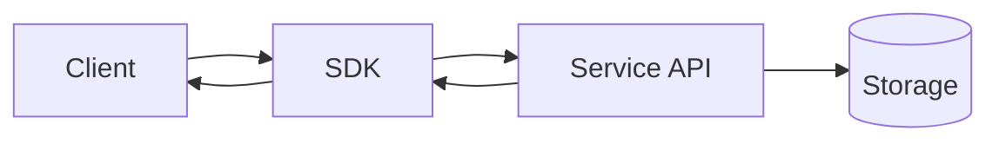
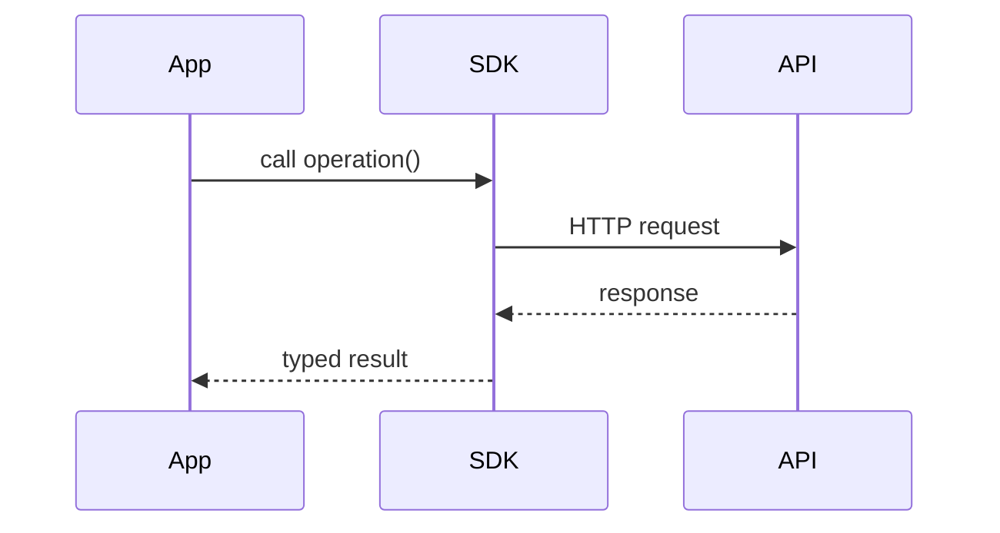

# Tutorial Patterns

Use this reference when choosing a guide shape, designing a running example, selecting a
visual, or reviewing an existing tutorial.

## Contents

1. Example-first progression
2. Tutorial skeleton
3. User-guide skeleton
4. Visual selector
5. Example quality rules
6. Professional-use checklist
7. Review rubric
8. Anti-patterns

## 1. Example-first progression

A strong running example usually evolves through these stages:

| Stage | Reader question | Author move |
| --- | --- | --- |
| First success | "Can I make it work?" | Show the smallest useful command, code, or action and its result. |
| Mental model | "What just happened?" | Name the few components or concepts visible in that example. |
| Extension | "How do I make it useful?" | Add one realistic requirement and modify the same example. |
| Integration | "How does this fit my application?" | Connect the relevant features in an end-to-end scenario. |
| Professional use | "How do I trust and operate this?" | Demonstrate applicable reliability, testing, security, performance, deployment, or maintenance practices. |

Do not teach a concept before the reader has a reason to need it. When possible, let a
new requirement expose the limitation first, then explain the concept that resolves it.

## 2. Tutorial skeleton

```markdown
# Build [specific outcome]

[Two-sentence orientation.]

## Make it work
[Minimal runnable example]
[Expected output]

## Add [capability]
[New requirement]
[Small code or action change]
[Expected output]

## See how it works
[Diagram and concise explanation]

## Handle [real-world concern]
[Example showing the concern]
[Improved implementation]
[Verification]

## Put it together
[Realistic end-to-end example]

## Next steps
[Specific related capabilities]
```

## 3. User-guide skeleton

```markdown
# [Product or feature] user guide

## Quickstart
[Fastest useful success]

## Core tasks
### [Common task 1]
### [Common task 2]

## How it works
[Compact mental model and visual]

## Practical workflows
### [Realistic workflow 1]
### [Realistic workflow 2]

## Advanced use
[Configuration, composition, extensibility, or automation]

## Production and operations
[Relevant reliability, security, performance, testing, or deployment guidance]

## Troubleshooting
[Symptoms → causes → fixes]
```

## 4. Visual selector

Choose a visual because it answers a question better than prose.

- **Architecture or component relationships:** Mermaid `flowchart`.
- **Request, API, event, or message lifecycle:** Mermaid `sequenceDiagram`.
- **Object or system states:** Mermaid `stateDiagram-v2`.
- **Data or entity relationships:** Mermaid `erDiagram` or a compact table.
- **Before/after behavior:** two short code or output blocks, or a comparison table.
- **UI workflow:** annotated screenshots from a verified environment; otherwise a
  numbered UI path.
- **Algorithm or branching decisions:** flowchart or short pseudocode before
  implementation.

Example architecture diagram:



Example interaction diagram:



Keep labels concrete. After the visual, state the one or two relationships the reader
should remember.

## 5. Example quality rules

- Make the first example complete enough to copy and run.
- Show setup commands, dependencies, imports, credential placeholders, or UI
  prerequisites where they are needed.
- Use realistic names and data without adding irrelevant domain complexity.
- Keep one source of truth for names and configuration across the guide.
- Show expected output after important operations.
- When an error or limitation motivates the next step, show the exact symptom only if it
  is source-backed or verified. Never invent an error message.
- Prefer additive edits. When a later example replaces an earlier pattern, explain what
  changed and why.
- If snippets omit unchanged code, mark the omission unambiguously.
- Never present unexecuted code, uncaptured screenshots, or theoretical output as
  verified.

## 6. Professional-use checklist

Select and demonstrate only what applies:

- errors, retries, validation, cancellation, and timeouts;
- authentication, authorization, secrets, and input safety;
- unit, integration, end-to-end, or contract testing;
- logging, metrics, tracing, diagnostics, and debuggability;
- performance, caching, batching, concurrency, memory, and rate limits;
- configuration, environments, deployment, migrations, and rollback;
- API lifecycle, versioning, backward compatibility, and deprecations; and
- code organization, reuse, extension points, and maintainability.

Do not turn this into a detached final checklist unless the user explicitly asks for one.

## 7. Review rubric

For a tutorial or guide review, rank findings by reader impact:

| Area | Check |
| --- | --- |
| Outcome | Does the title and introduction state what the reader will achieve? |
| First success | Can a new reader reach a useful, observable result quickly? |
| Setup | Are prerequisites, versions, credentials, and environment assumptions visible before use? |
| Learning flow | Does every step build on prior work and introduce one primary idea? |
| Examples | Are names, paths, commands, imports, and outputs consistent and complete enough to act on? |
| Evidence | Are claims, errors, screenshots, and outputs source-backed or clearly labeled as assumptions? |
| Explanation | Does the text explain why a change matters at the point it is introduced? |
| Visuals | Does each diagram or screenshot clarify a relationship or action that prose alone would obscure? |
| Real-world use | Are relevant operational concerns demonstrated, not merely listed? |
| Continuation | Does the ending provide specific next actions? |

For each material finding, state the affected section, reader impact, evidence, and a
targeted improvement. Avoid rewriting a complete guide when concise findings meet the
request.

## 8. Anti-patterns

Avoid:

- a long "What is X?" essay before the first example;
- many unrelated hello-world snippets instead of one evolving example;
- unexplained walls of code;
- examples without expected results;
- advanced sections that add obscure syntax rather than realistic capability;
- diagrams that duplicate prose without clarifying a relationship;
- generic claims such as "easy," "powerful," "robust," or "production-ready" without
  evidence;
- fabricated benchmarks, API behavior, compatibility claims, error output, or
  screenshots; and
- a vague ending when concrete next actions are available.
