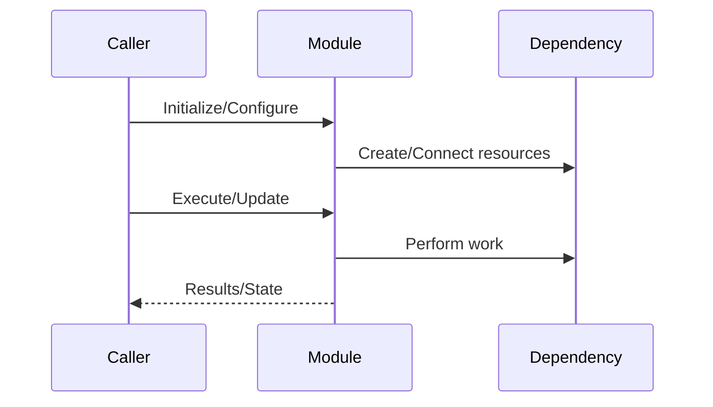

## Title

## Summary

- What this module/subsystem does.
- Who this document is for.

## Scope

- What is in scope.
- What is explicitly out of scope.

## Responsibilities

- Bullet list of responsibilities.
- What it depends on.
- What depends on it.

## Key Types and APIs

Summarize the important types and entry points.

- Namespaces
- Key classes/structs
- Key functions

## Data Flow and Lifetimes

- Ownership model (who allocates/frees what).
- Lifetime constraints (resources, handles, connections).
- Threading assumptions.

## Typical Workflows

Describe 1–2 representative runtime flows.

## Error Handling and Invariants

- What can fail.
- How errors are surfaced.
- Invariants the module maintains.

## Performance Notes

- Hot paths.
- Allocation patterns.
- Synchronization points.

## Extension Points

- How to add new features, handlers, modules, or integrations.
- What to avoid changing (public API contracts, data formats, stability constraints).

## Related Code

List the most relevant files/directories.

## Related Documentation

Link to existing doc/*.md.

## Open Questions / TODOs

List any unclear points that require confirmation.
