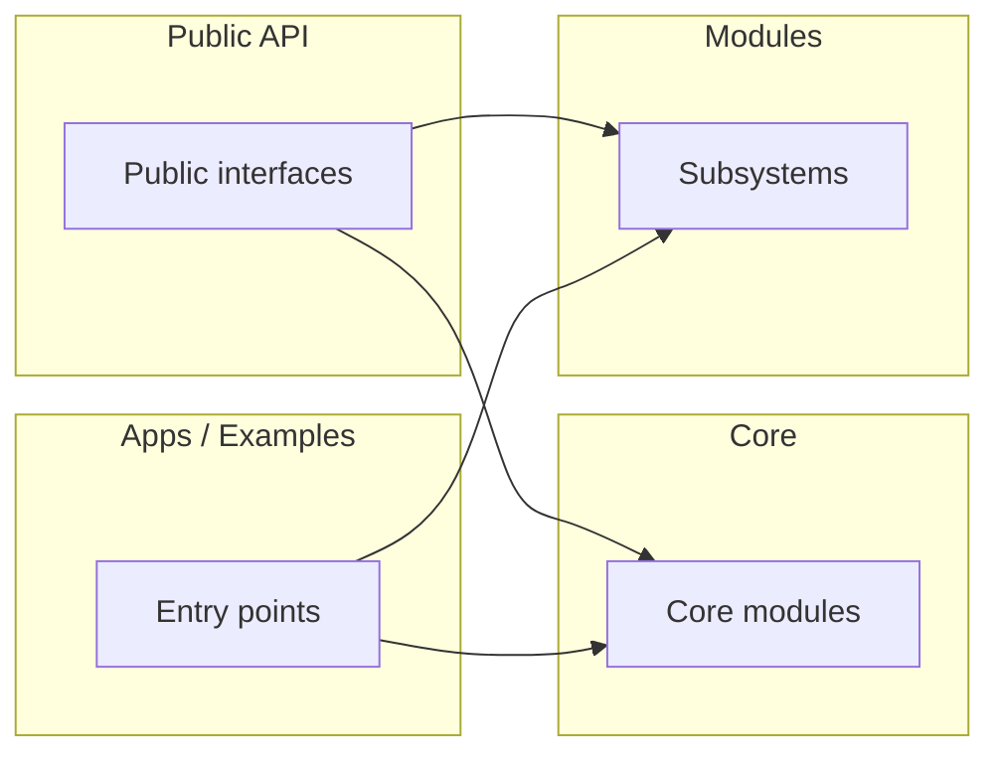

## Title

## Summary

- What this project is.
- What it provides (high level).
- Who this document is for.

## Scope

- This document describes the project at a high level.
- It intentionally avoids deep per-class/per-file details.

## Repository Layout (Modules)

Describe the major top-level folders and what belongs in them. Prefer listing
what exists in the repo instead of assuming a particular layout.

Common examples (only if present):

- src/
- include/
- docs/ or doc/
- tests/
- tools/ or scripts/
- examples/ or apps/
- build system files (e.g., CMakeLists.txt, package.json)

## Architecture (High Level)

Describe the major modules and how they relate.

If you ran a helper script to generate an include/component graph, embed the cleaned-up Mermaid diagram here (do not append it as a separate generated-doc artifact).

## Key Design Choices

- Architectural style (layering, modular boundaries, dependency direction).
- Ownership/lifetime model (resources, cleanup, error handling).
- Concurrency model (threads, async, tasks, queues) if present.
- Build and packaging strategy.

## Build + Artifacts (Conceptual)

High-level view of what the build produces and where outputs land.

- Libraries/binaries
- Generated code/assets (if any)
- Runtime inputs/outputs (config, assets, data files)

## Build Steps

_Whole-project docs should be runnable: include build instructions by default. Keep it short and link to the canonical source (e.g., README.md, docs)._ 

- Prerequisites (compiler/toolchain, package manager, SDKs)
- Configure step (if applicable)
- Build commands (Debug/Release)
- Where outputs land (binaries, libraries, generated files)

## Run Steps

_Whole-project docs should be runnable: include run instructions by default. Prefer minimal, copy-pastable commands._

- Typical entry points (binaries, scripts)
- Required runtime assets/config
- Common flags/options

## Test Steps (Conditional)

_Include this section only when the project appears to have unit tests (CTest, `tests/` folder, or an explicit test runner). Prefer the smallest set of commands to validate changes._

- Unit/integration tests (how to run)
- Lint/format/static analysis (if applicable)
- Where to find test outputs/logs

## Documentation Map

Link to existing docs under doc/ relevant to the project.

## Open Questions / TODOs

List any unclear points that require confirmation.

_Note for whole-project docs_: Avoid embedding per-header/per-class API indices unless the user explicitly asks. API indices are better suited to per-module docs.
